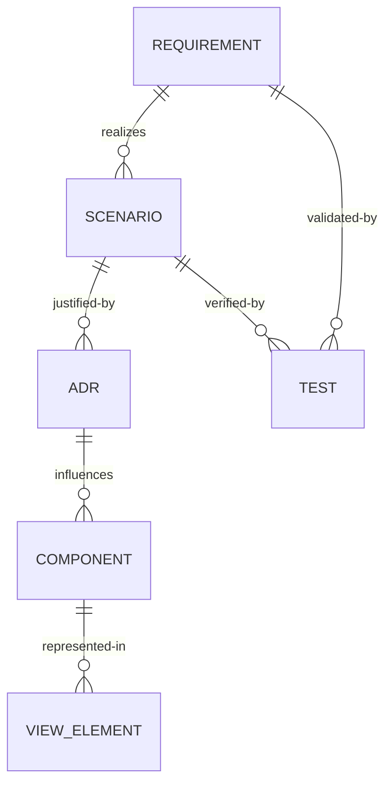

# Architecture Traceability Matrix

End-to-end linkage across requirements, architecture, decisions, scenarios, components, views, and tests. Enables automated CI validation.

## Data Model (Conceptual)


## Traceability Table
| Requirement ID | Scenario ID(s) | ADR ID(s) | Component ID(s) | View(s) | Test ID(s) | Gaps |
|----------------|---------------|----------|-----------------|---------|-----------|------|
| REQ-NF-P-001 | QA-SC-001 | ADR-002 | ARC-C-007 | logical, process, deployment | TEST-PERF-001 |  |
| REQ-NF-S-001 | QA-SC-003 | ADR-004 | ARC-C-003, ARC-C-010 | security, logical | TEST-SEC-LOGIN-001 |  |
| REQ-F-010 | QA-SC-002 | ADR-003 | ARC-C-002 | deployment, data | TEST-AVAIL-FAILOVER-001 |  |
| REQ-F-GM1-001 (#537) | QA-SC-GM1-001 | ADR-GM1-001 | DES-C-GM1-SAMPLE-001 | logical, data | TEST-GM1-SOUND-SET-* | ADR pending |
| REQ-F-GM1-002 (#538) | QA-SC-GM1-002 | ADR-GM1-001 | DES-C-GM1-SAMPLE-001 | logical, data | TEST-GM1-PERCUSSION-* | ADR pending |
| REQ-F-GM1-003 (#539) | QA-SC-GM1-003 | ADR-GM1-002 | DES-C-GM1-CHANNEL-001 | logical, process | TEST-GM1-PROGRAM-CHANGE-* | ADR pending |
| REQ-F-GM1-005 (#540) | QA-SC-GM1-005 | ADR-GM1-SAMPLE-001 | DES-C-GM1-SAMPLE-001 | logical, data, deployment | TEST-GM1-LOADING-001 to 010 | ADR pending |

## Orphan Detection Checklist
- [ ] Any Requirement without Scenario
- [ ] Any Scenario without ADR
- [ ] Any ADR without Component
- [ ] Any Component not present in at least one View
- [ ] Any Scenario without Test (or planned test ID)
- [ ] Any Requirement without Test coverage

## Automation Guidance
Represent this matrix as JSON (example) for CI script validation:
```json
[
  {
    "requirement": "REQ-NF-P-001",
    "scenarios": ["QA-SC-001"],
    "adrs": ["ADR-002"],
    "components": ["ARC-C-007"],
    "views": ["logical", "process", "deployment"],
    "tests": ["TEST-PERF-001"],
    "gaps": []
  },
  {
    "requirement": "REQ-F-GM1-005",
    "github_issue": 540,
    "scenarios": ["QA-SC-GM1-005"],
    "adrs": ["ADR-GM1-SAMPLE-001"],
    "components": ["DES-C-GM1-SAMPLE-001"],
    "views": ["logical", "data", "deployment"],
    "tests": ["TEST-GM1-LOADING-001 to 010"],
    "gaps": ["ADR-GM1-SAMPLE-001 pending formal creation"]
  }
]
```
CI Rule Examples:
- Fail if any field array empty (except gaps) for Critical requirements
- Warn if multiple requirements map to >5 ADRs (possible over-complexity)
- Warn if one ADR influences >10 components (possible centralization risk)

## Metrics
| Metric | Target | Calculation |
|--------|--------|-------------|
| Requirement Coverage | 100% | (# requirements with ≥1 scenario)/(total) |
| Scenario Test Coverage | 100% | (# scenarios with ≥1 test)/(total scenarios) |
| ADR Linkage Completeness | 100% | (# ADRs linked to ≥1 requirement)/(total ADRs) |
| Component View Coverage | 100% | (# components in ≥1 view)/(total components) |
| Average Components per ADR | < 8 | sum(components linked)/#ADRs |

## Review Notes
Record anomalies, justification for intentional gaps, and planned remediation.
